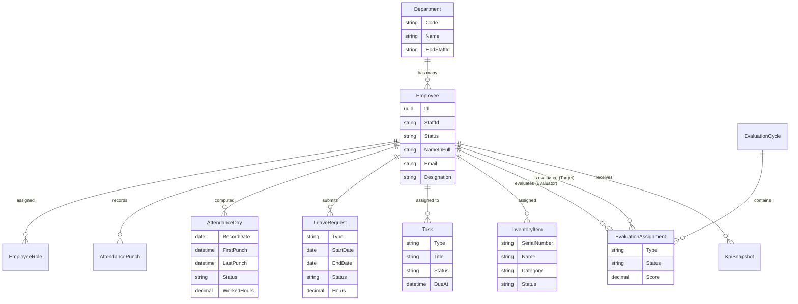

# Entity Relationship Diagram

```mermaid
erDiagram
    Department ||--o{ Employee : "has many"
    Employee ||--o{ EmployeeRole : "assigned"
    Employee ||--o{ AttendancePunch : "records"
    Employee ||--o{ AttendanceDay : "computed"
    Employee ||--o{ LeaveRequest : "submits"
    Employee ||--o{ Task : "assigned to"
    Employee ||--o{ InventoryItem : "assigned"
    
    EvaluationCycle ||--o{ EvaluationAssignment : "contains"
    Employee ||--o{ EvaluationAssignment : "evaluates (Evaluator)"
    Employee ||--o{ EvaluationAssignment : "is evaluated (Target)"
    
    Employee ||--o{ KpiSnapshot : "receives"

    Department {
        string Code
        string Name
        string HodStaffId
    }
    
    Employee {
        uuid Id
        string StaffId
        string Status
        string NameInFull
        string Email
        string Designation
    }
    
    AttendanceDay {
        date RecordDate
        datetime FirstPunch
        datetime LastPunch
        string Status
        decimal WorkedHours
    }
    
    LeaveRequest {
        string Type
        date StartDate
        date EndDate
        string Status
        decimal Hours
    }
    
    Task {
        string Type
        string Title
        string Status
        datetime DueAt
    }
    
    InventoryItem {
        string SerialNumber
        string Name
        string Category
        string Status
    }
    
    EvaluationAssignment {
        string Type
        string Status
        decimal Score
    }
```
